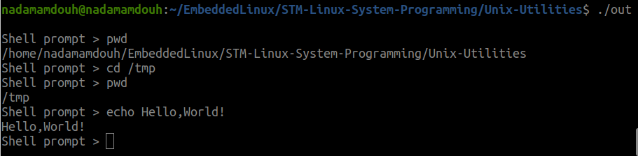
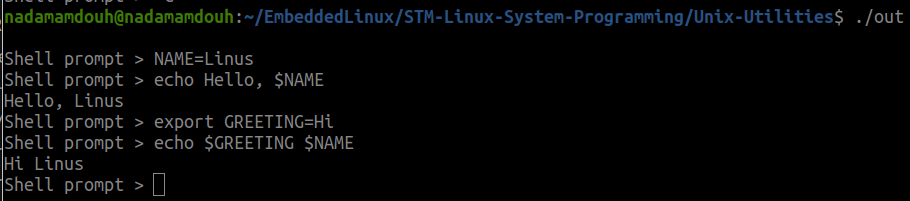
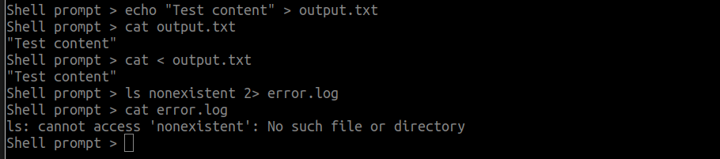
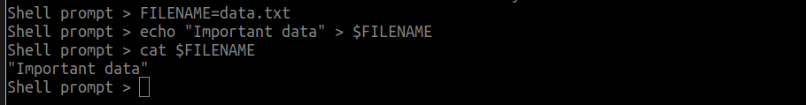

# Micro Shell - A Simple Unix Shell Implementation

## Overview
Micro Shell is a lightweight, custom Unix shell implementation written in C. It provides basic shell functionality including command execution, I/O redirection, variable management, and built-in commands.

## Features

### 1. **Built-in Commands**
- **`pwd`** - Print the current working directory
- **`cd [directory]`** - Change directory (defaults to HOME if no argument provided)
- **`echo [text]`** - Display text to standard output
- **`exit`** - Exit the shell with a farewell message

### 2. **External Command Execution**
- Execute any external command available in the system PATH
- Full support for command arguments
- Proper error handling with informative messages (e.g., "command not found")

### 3. **Variable Management**

#### Local Variables
- Define local variables: `VAR=value`
- Access variables using `$VAR` syntax
- Variables persist throughout the shell session
- Automatic variable substitution in commands

#### Environment Variables
- Export variables to environment: `export VAR=value`
- Promote local variables to environment: `export VAR`
- Environment variables inherited by child processes

### 4. **Variable Substitution**
- Use `$VARIABLE` syntax in any command or argument
- Variables are expanded before command execution
- Supports both local and environment variables
- Example: `echo $HOME` or `cd $USER_DIR`

### 5. **I/O Redirection**

#### Input Redirection (`<`)
```bash
command < input_file
```
- Redirect standard input from a file
- Custom error message: "cannot access file: No such file or directory"

#### Output Redirection (`>`)
```bash
command > output_file
```
- Redirect standard output to a file
- Creates file if it doesn't exist, truncates if it does

#### Error Redirection (`2>`)
```bash
command 2> error_file
```
- Redirect standard error to a file
- Useful for separating error messages from regular output

#### Multiple Redirections
```bash
command < input.txt > output.txt 2> error.log
```
- Combine multiple redirections in a single command
- Redirections are processed left to right

### 6. **Advanced Features**

#### Smart Space Handling
- Automatically normalizes multiple consecutive spaces to single spaces
- Trims trailing spaces before redirection operators
- Ensures clean command parsing

#### Exit Status Tracking
- Tracks the exit status of the last executed command
- Used as the exit code when the shell terminates
- Accessible for error checking

#### Process Management
- Fork-exec model for external commands
- Proper parent-child process handling
- Wait for child processes to complete
- Handles fork failures gracefully

## Usage Examples

### Basic Commands


### Variable Management


### I/O Redirection


### Combined Features


## Technical Details

### Architecture
- **Main Loop**: Continuously prompts for input and processes commands
- **Parser**: Tokenizes input into command and arguments
- **Variable Expander**: Substitutes variable references with their values
- **Redirection Handler**: Processes I/O redirection operators before execution
- **Executor**: Forks processes and executes commands

### Memory Management
- Dynamic memory allocation for strings and data structures
- Proper cleanup of allocated memory
- Linked list implementation for variable storage
- Memory leak prevention with careful free() calls

### Error Handling
- Comprehensive error checking for system calls
- Informative error messages using `perror()` and `fprintf(stderr, ...)`
- Graceful handling of missing files, invalid commands, and failed operations
- Exit status codes properly propagated

### Process Model
- Built-in commands execute in the parent process
- External commands execute in child processes via `fork()` and `execvp()`
- File descriptor management for redirection
- Proper restoration of standard file descriptors after redirection

## Function Reference

### Core Functions

| Function | Description |
|----------|-------------|
| `main()` | Main shell loop - handles prompt, input, and command dispatch |
| `getCmd()` | Reads and parses user input into command and arguments |
| `execute_custom_cmd()` | Forks and executes external commands |

### Built-in Command Functions

| Function | Description |
|----------|-------------|
| `pwd_cmd()` | Prints current working directory |
| `cd_cmd()` | Changes current directory |
| `echo_cmd()` | Displays text to stdout |
| `exit_cmd()` | Exits the shell |

### Variable Management Functions

| Function | Description |
|----------|-------------|
| `set_local_var()` | Creates or updates a local variable |
| `get_local_var()` | Retrieves a local variable value |
| `set_env_var()` | Sets an environment variable |
| `get_env_var()` | Retrieves an environment variable value |
| `Substitute_var()` | Expands `$VAR` references in strings |
| `extract_var()` | Parses variable assignment statements |
| `free_local_vars()` | Frees all local variable memory |

### Utility Functions

| Function | Description |
|----------|-------------|
| `handle_spaces()` | Normalizes whitespace in input |
| `handle_redirection()` | Processes I/O redirection operators |
| `restore_fds()` | Restores standard file descriptors |
| `is_assignment()` | Checks if command is a variable assignment |

## Data Structures

### Variables Structure
```c
typedef struct Variables {
    char *variable;         // Variable name
    char *value;           // Variable value
    struct Variables *next; // Next node in linked list
} Variables;
```

### Global Variables
- `char *cmd` - Current command
- `char *arg` - Command arguments
- `int status` - Exit status of last command
- `Variables *local_vars` - Linked list of local variables
- `int save_fd_in/out/err` - Saved file descriptors for redirection

## Building and Running

### Compilation
```bash
gcc main.c -o out 
```

### Execution
```bash
./out
```


## Exit
```bash
Shell prompt > exit
Good Bye
```

## Error Messages

| Error | Cause |
|-------|-------|
| `command not found` | Command doesn't exist in PATH |
| `cd: HOME not set` | HOME environment variable not defined |
| `cd: /path: No such file or directory` | Directory doesn't exist |
| `cannot access file: No such file or directory` | Input redirection file not found |
| `export: variable: not found` | Attempting to export undefined local variable |
| `PARENT: failed to fork` | Fork system call failed |

---

## License

This is an educational project. Feel free to use, modify, and distribute.

---

**Version**: 1.0  
**Last Updated**: 2026  
**Language**: C (C99)  
**Platform**: Linux/Unix